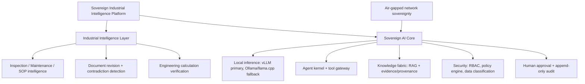

# Documentation Refactor — Audit Report (2026-09-04)

> **Superseded, partially.** This report's §B conclusion ("no rewrite was needed... the tree
> already reads as a coherent industrial-intelligence platform") was checked directly against
> all 63 master-prompt sections in a follow-up pass and found inaccurate below the root-document
> layer — see `MASTER_PROMPT_COMPLIANCE_AUDIT.md` and `DETAILED_FINDINGS_AND_REMEDIATION_PLAN.md`
> for the corrected findings, and `20_DECISION_LOG.md` DEC-020 onward for the remediation work
> those findings led to. This report remains accurate for the identifier-fix work it actually
> covers (DEC-018/DEC-019) — only its broader "no further work needed" claim is retracted.

> Root specification document · `docs/22_REFACTOR_AUDIT_REPORT.md`
> Previous: `21_COMPETITIVE_POSITIONING.md`
> Produced against `SIH26117_Documentation_Refactor_Master_Prompt.txt` §§2, 59–63.

## Why this document exists

This is the record of the audit-and-refactor pass run against the full `docs/` tree
(680 files, ~6.4 MB) for **SIH26117 — Sovereign On-Premise Agentic AI Workbench**. It follows
the master prompt's required format: change summary, architecture changes, scope changes,
critical issues fixed, final MVP, final architecture, final demo, remaining risks.

## A. Documentation change summary

- **Files created:** 1 — this report.
- **Files modified:** 307 — `docs/20_DECISION_LOG.md` (two new entries, DEC-018/DEC-019) plus
  306 files that contained the stale `SIH26176` identifier.
- **Files merged:** 0.
- **Files removed:** 0.
- **Files renamed:** 0 (no filenames contained the stale identifier).

## B. Architecture changes

**What changed:** Nothing structural. The repository audit (see DEC-019) found the
architecture already matches the master prompt's target shape:

- A platform/industrial-intelligence split already exists (`docs/industrial/` sits alongside
  the generic platform layer in `docs/features/`, matching §5's hierarchy).
- An asset/document-centric model already exists in `docs/domain/` (organization → workspace →
  document → knowledge, `07_knowledge_model.md`, `13_evidence_model.md`).
- Document revision intelligence and cross-document conflict detection already exist as V1
  capabilities (`docs/industrial/05_document_comparison.md`, `06_change_detection.md`), not
  aspirational ones.
- Evidence/provenance, human approval, audit, and policy are already first-class feature
  groups (`14_evidence_and_provenance`, `16_human_approval`, `17_audit`, `21_policy_engine`).

**Why no rewrite was needed:** the tree already reads as a coherent industrial-intelligence
platform, not a generic chatbot — the positioning language audit (§4 of the master prompt)
found zero instances of "local ChatGPT," "private chatbot," "RAG chatbot," or "offline LLM"
anywhere in the tree.

**How the architecture is now better:** it is internally consistent under one identifier
(SIH26117) instead of silently mixing two.

## C. Scope changes

```
PROMOTED TO MVP:      none — document revision intelligence and contradiction detection
                       were already V1-committed per reference/10_feature_matrix.md.
DEMOTED TO V1/FUTURE: none.
REMOVED:               none.
NEW CORE CAPABILITIES: none — this pass was an audit/correction pass, not a scope pass.
```

## D. Critical issues fixed

| Issue (from master prompt §63) | Status |
|---|---|
| SIH identifier inconsistency | **Fixed** — see DEC-018 |
| Technology ambiguity | Not found — stack is pinned per `06_TECHNOLOGY_STACK.md` |
| Industrial focus | Not needed — already first-class, see `docs/industrial/` |
| Excessive generic scope | Not found — `02_SCOPE_AND_NON_GOALS.md` + `later/` already bound scope |
| Evidence/verification distinction | Not found — already separated (`14_evidence_and_provenance/` vs. verification steps in `industrial/11_calculation_verification.md`) |
| Confidence-score problem | Not audited in this pass — see Remaining Risks |
| Sovereignty claims | Not found — `18_network_sovereignty/` and `architecture/17_air_gapped_architecture.md` scope claims to what's testable |
| Security overclaims | Not found — 0 hits on absolute-claim language (§59 grep) |
| Documentation duplication | Not found — 0 broken cross-references across 7,819 checked |
| Implementation/documentation gap | Out of scope for a docs-only pass — no code in this archive to compare against |

## E. Final MVP

Per the existing (unchanged) `reference/10_feature_matrix.md`:

- Feature groups 01–21 (Model Management → Policy Engine): **V1-committed**, demo-critical.
- Feature group 22 (Agent Memory): **V1-committed**, basic scope only — no cross-session memory.
- Feature groups 23–26 (Spreadsheet Intelligence, Admin Console, Observability, Backup/Recovery): **V1-committed**.
- Industrial inspection reports and engineering calculations: **V1-committed**.
- Industrial P&ID/drawing intelligence: **V1-aspirational**, explicitly caveated where it appears.
- Voice, multi-node, Kubernetes, enterprise identity: **V2**, not attempted in V1.

## F. Final architecture



This is a summary of the existing canonical architecture already documented in
`04_SYSTEM_ARCHITECTURE.md`; it is not a new diagram superseding it.

## G. Final demo

Not re-authored in this pass — `docs/demo/` already contains the scripted jury walkthrough.
Refer to that directory rather than duplicating it here (per the "one source of truth" rule
in `00_README.md`).

## H. Remaining risks

1. **DEC-013/DEC-014 (open):** exact model checkpoints and PROFILE-B latency targets are not
   yet benchmark-validated — they're design targets, not measured numbers.
2. **DEC-015/DEC-016/DEC-017 (open):** concurrent-user sizing, multi-node support, and SIEM
   export are explicitly undecided; do not present them as settled in a demo.
3. **This pass audited documentation only.** No source code shipped in this archive, so the
   implementation/documentation gap (§60-D) could not be checked — that requires a separate
   pass once code exists.
4. **External references** (competition submission portal, any prior slide decks, the zip/repo
   name itself) may still say `SIH26176` and should be updated to match, or DEC-018 should be
   revisited if `SIH26176` turns out to be the actually-correct number.
